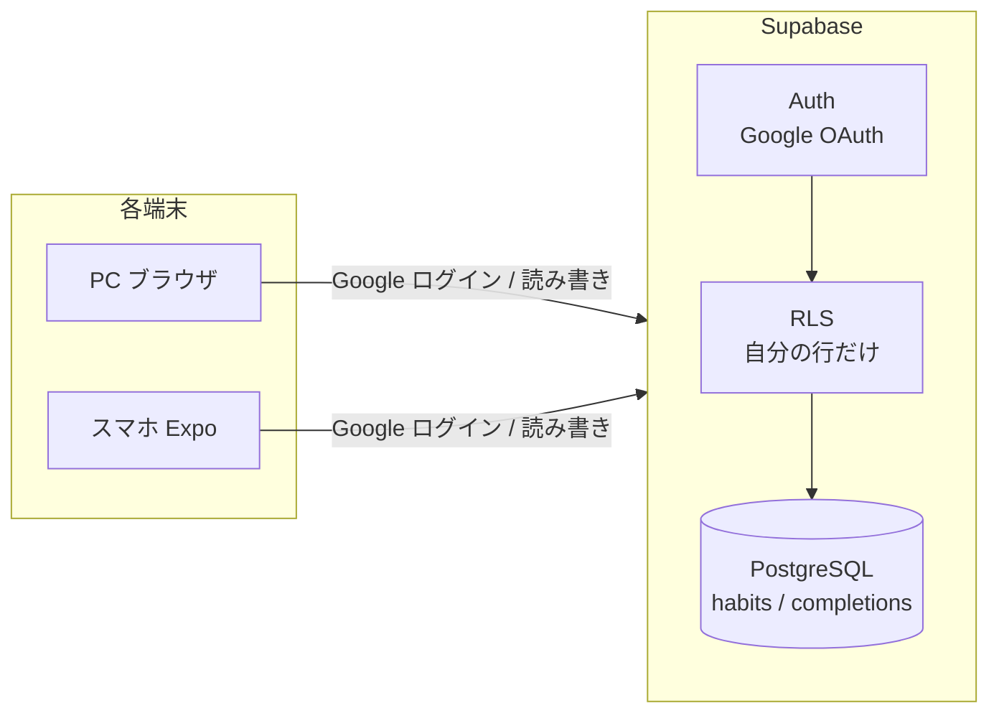

# Supabase 認証＋クラウド同期 設計調査（Issue #27 / Epic #26）

複数端末（PC・スマホ）で同じデータを使い、Google ログインできるようにするための設計調査。
バックエンドは **Supabase**（PostgreSQL + Auth + RLS）に決定済み。

## 全体像



ポイントは **「ログインで user_id が決まり、RLS がその user_id の行だけ読み書きを許す」** こと。
クライアントのコードを改ざんされても、他人のデータには触れない（DB 側で強制するため）。

---

## 1. 認証（Google ログイン）

### 方式は2つ。プラットフォームで使い分ける

| 方式 | 仕組み | Expo Go | 向き |
|---|---|---|---|
| **OAuth web flow**（`signInWithOAuth`） | ブラウザを開いて Google 認証 → リダイレクトで戻る | △ 動く（deep link 設定が要る） | Web・まず動かす |
| **ネイティブ Google Sign-In**（`react-native-google-signin`） | OS ネイティブの Google ログイン UI | ✗ **dev build 必須** | スマホ本番体験 |

> **重要な制約**: ネイティブ Sign-In は **Expo Go では動かない**。EAS か local で **development build** を作る必要がある。
> 今ユーザーはスマホで Expo Go を使っているので、いきなりネイティブ方式に行くと「ビルド環境の整備」という別の山が増える。

### 採用方針（段階的）

1. **第1段階**: `signInWithOAuth`（ブラウザ経由）で **Web（PC）から先に**ログインを通す。
   - Web では追加ネイティブ依存ゼロで動く。動作確認が速い。
2. **第2段階**: スマホは当面 **Web 版（`expo start --web` を端末ブラウザで開く）**でも同期を体験できる。
3. **第3段階（余力）**: スマホのネイティブ体験が欲しくなったら dev build + `react-native-google-signin` を導入。

→ つまり **「まず Web で認証＋同期を完成」→「ネイティブ化は後追い」** が認知負荷の低い順序。

### セッションの保持
- Supabase クライアントに **AsyncStorage をセッションストレージとして渡す**（`auth.storage`）。
  - ネイティブ: `@react-native-async-storage/async-storage`（導入済み）
  - Web: localStorage（自動）
- これでアプリ再起動後もログイン状態が残る。
- `auth.autoRefreshToken: true` / `persistSession: true` を設定。

### セキュリティ
- Google の ID トークン検証は **Supabase がサーバ側で Google の公開鍵に対して行う**。クライアントは検証ロジックを持たない。
- アプリに置くのは **publishable key（公開鍵）**のみ。secret key はアプリに絶対入れない。
  - 2026 年以降は新キー体系（`sb_publishable_...` / `sb_secret_...`）。レガシー anon/service キーは年内に非推奨化予定。

---

## 2. DB スキーマ案

今は「習慣の中に達成日配列（`completedDates: string[]`）」を1かたまりで持っている。
DB では **正規化して2テーブルに分ける**のが素直（同期競合も減る）。

```sql
-- 習慣
create table habits (
  id          uuid primary key default gen_random_uuid(),
  user_id     uuid not null references auth.users(id) default auth.uid(),
  name        text not null,
  created_at  timestamptz not null default now(),
  sort_order  int  not null default 0
);

-- 達成記録（1行＝ある習慣をある日やった）
create table completions (
  habit_id  uuid not null references habits(id) on delete cascade,
  date_key  date not null,
  user_id   uuid not null references auth.users(id) default auth.uid(),
  primary key (habit_id, date_key)
);
```

- `completedDates` 配列 → `completions` の行に展開。トグルは「行の insert / delete」になる。
- `on delete cascade`: 習慣を消すと達成記録も自動で消える。
- `default auth.uid()`: 挿入時にログインユーザーの id が自動で入る。

### RLS ポリシー（自分の行だけ）

```sql
alter table habits      enable row level security;
alter table completions enable row level security;

-- 例: habits は本人のみ全操作可
create policy "own habits" on habits
  for all using (auth.uid() = user_id) with check (auth.uid() = user_id);

create policy "own completions" on completions
  for all using (auth.uid() = user_id) with check (auth.uid() = user_id);
```

---

## 3. 既存 storage 層の差し替え

### 効いてくる既存設計
`src/storage/habitStorage.ts` がデータ入出力を隔離しており、UI/フックは保存先を知らない。
→ **このファイルの中身をクラウド版に差し替える**のが基本方針（依存方向は内向きのまま）。

### ただし interface は見直しが要る
現状は「全習慣を丸ごと load / save」という粒度。クラウドでは全件上書きは非効率かつ競合の元。
段階的にこうする:

- **Step E-1（移行を最小に）**: `loadHabits()` は Supabase から全件 SELECT して今と同じ `Habit[]` 形に組み立てて返す。`saveHabits()` は当面そのまま全件 upsert。→ **UI/フックを一切変えずに**クラウド化できる。
- **Step E-2（最適化）**: トグルや rename を「その行だけ更新」する細かい API に置き換え、`HabitsContext` 側を寄せる。

→ まず E-1 で「動くクラウド同期」を最短で出し、E-2 は後で。

---

## 4. オフラインの扱い（#F・最後）

- 第1段階は **オンライン前提**（起動時に SELECT、操作で即 DB 反映）で割り切る。
- 仕上げで「ローカル（AsyncStorage）をキャッシュにし、オフライン操作をキューして再接続時に同期」を検討。
  - 競合解決が必要になるため、最後に回す。複数端末同期そのものはオフライン無しでも成立する。

---

## 5. 後続 Issue への落とし込み

| Issue | 内容 | 依存 |
|---|---|---|
| #B | Supabase プロジェクト作成・client 初期化・env・接続確認 | — |
| #C | Google ログイン（まず Web の OAuth web flow）＋セッション保持＋ログイン画面 | #B |
| #D | スキーマ（habits/completions）＋ RLS を Supabase に適用 | #B |
| #E | storage 層をクラウド版に差し替え（E-1 全件 → E-2 行単位） | #C #D |
| #F | ローカルキャッシュ＆オフライン同期 | #E |

### 環境変数（秘密情報の扱い）
- `EXPO_PUBLIC_SUPABASE_URL` / `EXPO_PUBLIC_SUPABASE_PUBLISHABLE_KEY` を `.env` に置く。
- **publishable key は公開前提なので `EXPO_PUBLIC_` でクライアントに載せてよい**（RLS が守る）。
- secret key は使わない / リポジトリに入れない。`.env` は `.gitignore` 済みを確認する。

---

## まとめ（次の一歩）

- 認証は **Web の OAuth web flow から**始めるのが最短・最小リスク。ネイティブ化は後追い。
- DB は **2テーブル正規化 + RLS**。RLS が「自分の行だけ」をサーバ側で強制する。
- 移行は **storage 層の差し替え**で、まず全件 load/save 互換のまま（E-1）クラウド化。
- → 着手順: **#B（接続）→ #D（スキーマ）→ #C（ログイン）→ #E（差し替え）→ #F（オフライン）**。
  （#C と #D は独立なので並行可。接続が出来たら両輪で進められる。）

## 出典
- [Build a Social Auth App with Expo React Native | Supabase Docs](https://supabase.com/docs/guides/auth/quickstarts/with-expo-react-native-social-auth)
- [Using Supabase - Expo Documentation](https://docs.expo.dev/guides/using-supabase/)
- [Login with Google | Supabase Docs](https://supabase.com/docs/guides/auth/social-login/auth-google)
- [Use Supabase Auth with React Native | Supabase Docs](https://supabase.com/docs/guides/auth/quickstarts/react-native)
- [React Native Google Sign-In: Supabase 2026 Guide](https://www.agilesoftlabs.com/blog/2026/02/react-native-google-sign-in-supabase_11)
