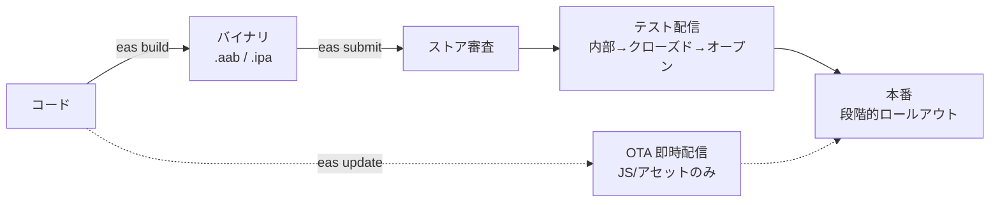

# EAS によるストア公開と段階的リリースの調査（Issue #29 / 実装 #30）

Expo アプリ（このプロジェクト）を Google Play / iOS App Store に公開し、
**段階的にリリースする**方法の調査。結論: **両ストアとも段階リリースは標準サポート**で、
Expo なら **EAS** でビルド〜申請〜OTA まで回せる。

> **EAS（Expo Application Services）** = Expo のクラウドビルド/申請サービス。
> 手元に Xcode / Android SDK を入れなくても、クラウドで `.aab`(Android) / `.ipa`(iOS) を
> 作ってストアに送れる。

## 全体パイプライン



3つのコマンドが柱:
- **`eas build`** — クラウドでバイナリ生成
- **`eas submit`** — バイナリをストアへアップロード
- **`eas update`** — 審査を通さず JS/アセットだけ即配信（OTA）

---

## 段階的リリース（本命）

### Google Play（Android）
1. **内部テスト** — 数人に即配信。審査ほぼ無しで最速。
2. **クローズドテスト** — 招待者限定。
3. **オープンテスト** — 公開ベータ（誰でも参加可）。
4. **製品版 + 段階的公開** — 本番でも配信割合を `10% → 50% → 100%` と絞れる。
   問題が出たら途中で停止可能。

### Apple App Store（iOS）
1. **TestFlight（内部）** — チーム内に即配信。
2. **TestFlight（外部）** — 最大1万人のベータ（簡易審査）。
3. **本番 + 段階リリース（Phased Release）** — 審査通過後 **7日かけて自動で
   1%→2%→…→100%**。一時停止も可能。

→ 両者とも **「身内 → ベータ → 本番を割合で」** を正式サポート。少しずつ安全に出せる。

---

## OTA アップデート（`eas update`）

**JS とアセットの変更だけなら、ストア審査を通さず即・段階配信できる**（Expo の強み）。

- バグ修正・文言変更なら、申請待ち（数時間〜数日）を待たず数分で配信。
- ロールアウト % を指定可能。
- **制約**: ネイティブ依存の追加・変更（例: 今後ネイティブ Google Sign-In を入れる時）は
  OTA 不可。**再ビルド＆ストア提出**が必要。
  - → JS で完結する機能は OTA、ネイティブが絡む変更はストア経由、と覚える。

---

## 前提（お金・環境）

| 項目 | iOS | Android |
|---|---|---|
| 開発者登録料 | **$99 / 年** | **$25（買い切り1回）** |
| ビルド環境 | EAS クラウドで Mac 不要 | EAS クラウドでOK |
| 審査 | あり（TestFlight 外部含む） | あり（テスト段階は緩い） |

- **EAS にも無料枠**あり（月のビルド本数に上限、混雑時は待ち）。本格運用は有料プラン。
- iOS は実機配布に Apple Developer 登録（$99/年）が必須。
- → **まず Android（$25・審査緩め）から始める方が安く速い。**

---

## `eas.json` のプロファイル設計（イメージ）

```jsonc
{
  "build": {
    "preview":     { "distribution": "internal" },   // 内部テスト用 .aab/.apk
    "production":  { "autoIncrement": true }          // 本番（versionCode 自動++）
  },
  "submit": {
    "production": { /* Google Play / App Store の送信先設定 */ }
  }
}
```

- `preview` = 内部テスト配布用、`production` = 本番、と用途でプロファイルを分ける。
- 署名鍵（Android keystore / iOS 証明書）は **EAS が生成・管理**してくれる（手元保管も可）。

---

## このプロジェクトでの推奨順序

複数端末＋認証（Epic #26）が一段落してから #30 で着手する想定:

1. **`eas build:configure`** で `eas.json` 初期化。
2. **Android 内部テスト**を一度通す（`eas build -p android --profile preview` → `eas submit`）。
   最も安く・速く全工程を体験できる。
3. **オープンテスト**で実ユーザーに触ってもらう。
4. **製品版を段階的公開 10%→** で本番投入。
5. iOS は登録料を払う判断ができたら TestFlight から同じ流れ。
6. 仕上げに **`eas update`** で OTA を有効化（JS 修正の即配信）。

### 注意点（先に潰しておくと楽）
- **app.json の `ios.bundleIdentifier` / `android.package`** を一意な値で確定しておく（後から変えると別アプリ扱い）。
- **アイコン・スプラッシュ・ストア掲載情報（説明文・スクショ）** が審査で要る。
- **プライバシー**: Google 認証でメール等を扱うため、プライバシーポリシー URL が両ストアで必要。

---

## まとめ
- 段階リリースは **可能**。Android=配信%絞り / iOS=7日 Phased Release。
- **EAS build → submit → （OTAは update）** の3本柱。
- **Android 内部テストから始める**のが最小コストで全工程を学べる。
- 実装は #30 で、複数端末対応の後。bundleId/package とプライバシーポリシーを先に確定。

## 出典
- [Build a Social Auth App / Expo を含む Submit ガイド | Expo Docs](https://docs.expo.dev/submit/introduction/)
- [EAS Build | Expo Docs](https://docs.expo.dev/build/introduction/)
- [EAS Update | Expo Docs](https://docs.expo.dev/eas-update/introduction/)
- [Google Play staged rollouts / testing tracks | Play Console Help](https://support.google.com/googleplay/android-developer/answer/9859348)
- [Phased release for automatic updates | Apple Developer](https://developer.apple.com/help/app-store-connect/update-your-app/release-a-version-update-in-phases/)
