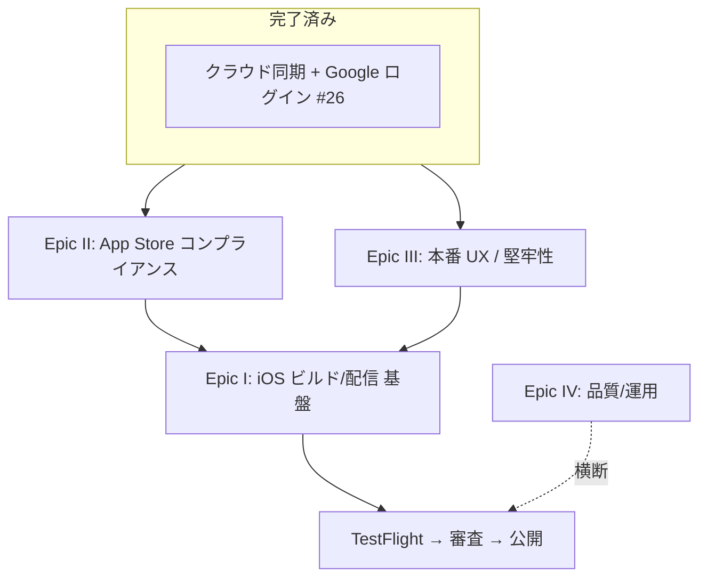

# iOS アプリ公開までのロードマップ調査

「habit-tracker を iOS アプリとして App Store で公開する」ための、足りない部分の調査と Epic 提案。

## 現状（2026-06-27 時点）
- Expo + TypeScript。クラウド同期（Supabase）＋ Google ログイン（OAuth web flow）が**実環境で動作**。
- 既存: 習慣の追加/削除/リネーム/トグル/ストリーク/カレンダー/履歴。RLS 済み。純粋ロジックは jest。
- まだ無い: iOS 実機ビルド、App Store 審査要件対応、サインアウト/設定 UI、オフライン、行単位同期最適化、CI。

## App Store 公開の「ゲート要件」（落ちる/出せない条件）

> 出典は末尾。Apple のガイドラインは変わるので、提出直前に最新版で再確認すること。

1. **Apple Developer Program 登録**（年 $99）。これが無いと TestFlight も提出も不可。
2. **Guideline 4.8 — 代替ログイン必須**: Google ログインを提供するなら、「名前とメールのみ収集／メール非公開可／広告目的の追跡なし」を満たす**同等の代替ログイン**も出す必要がある。実質 **Sign in with Apple** の追加が必要。
3. **Guideline 5.1.1(v) — アプリ内アカウント削除必須**: アカウント作成があるアプリは、アプリ内から**アカウントと関連データの削除を開始**できること。無効化だけでは不可。
4. **プライバシーポリシー URL**（App Store Connect 必須）＋ **App Privacy（データ収集ラベル）**の申告。
5. **アイコン/スプラッシュ/各種メタ**（スクショ、説明、年齢レーティング、サポート URL）。

## 提案 Epic（公開までを4本に分割）

### Epic I: iOS ビルド/配信 基盤（EAS）
既存 Issue #30（リリースパイプライン整備）と重なる。調査は research なし→ #29 で実施済み。
- EAS Build で iOS ビルド（Mac 不要・クラウドビルド）。bundle id / version / buildNumber 設定。
- **development build** 作成（Expo Go では native 機能や Sign in with Apple が試せないため）。
- TestFlight 配信で実機テスト。
- （任意）EAS Update で OTA 更新。

### Epic II: App Store コンプライアンス
- **Sign in with Apple 追加**（Guideline 4.8）。`expo-apple-authentication` + Supabase の Apple プロバイダ。
- **アカウント削除機能**（Guideline 5.1.1）。設定画面に「アカウント削除」。
  - 自分の habits/completions を削除し、auth ユーザーも削除（Supabase は管理者権限が要るので **Edge Function** 経由が定石）。
- **プライバシーポリシー**作成・公開（URL）。
- **App Privacy ラベル**の申告内容を整理（メール・習慣データの収集）。
- アイコン/スプラッシュ/スクショ/説明文/年齢レーティングの最終化。

### Epic III: 本番 UX / 堅牢性
- **設定/プロフィール画面 + サインアウト**（今 `signOut` は実装済みだが UI から呼べない）。
- ログイン/同期の**エラー・ローディング表示**の整備。
- **E-2**: toggle/rename を行単位更新に最適化（今は保存ごとに completions 全置換で重い・同時編集に弱い）。
- **#F**: オフライン対応（ローカルキャッシュ＋再接続同期、競合解決）。
- ネットワーク断・トークン失効時の挙動。

### Epic IV: 品質 / 運用（横断）
- **CI**（GitHub Actions で PR ごとに `tsc` / `jest`）。
- エラー監視（Sentry 等・任意）。
- リリースノート/バージョニング運用。

## おすすめ順序
1. **Epic III の足元**（設定画面＋サインアウト、エラー表示）— 審査前に UX の穴を塞ぐ。
2. **Epic II**（Sign in with Apple＋アカウント削除＋プライバシー）— 審査ゲートなので最優先で潰す。
3. **Epic I**（EAS→TestFlight）— 実機で通し確認。
4. 仕上げに **E-2 / #F / CI**。

> Sign in with Apple とアカウント削除は「無いと審査で落ちる」ため、ビルド基盤(Epic I)より前に設計を始めるのが安全。

## 出典
- [App Review Guidelines - Apple Developer](https://developer.apple.com/app-store/review/guidelines/)
- [Offering account deletion in your app - Apple Developer](https://developer.apple.com/support/offering-account-deletion-in-your-app/)
- [Account deletion requirement (5.1.1) - Apple Developer News](https://developer.apple.com/news/?id=mdkbobfo)
- 既存: `research/02-eas-release.md`（EAS 調査, Issue #29）
