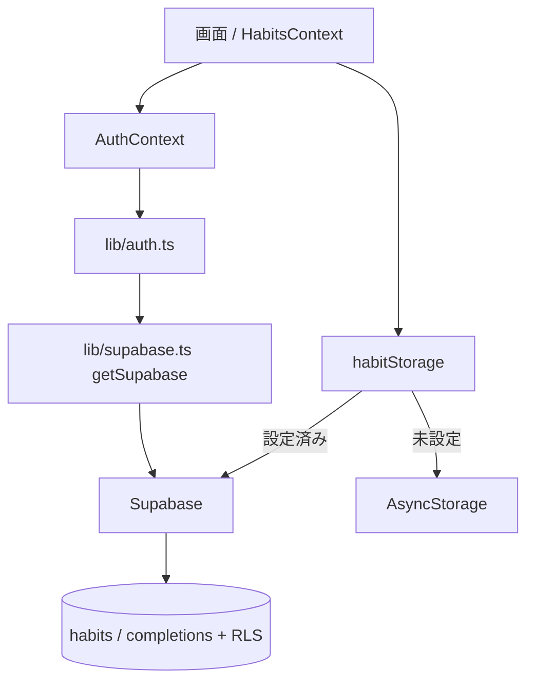

# クラウド同期（Supabase 認証＋同期）実装まとめ

Epic #26「複数端末対応」の実装サマリ。設計は `research/01-supabase-auth-sync.md`。

## できるようになったこと
- Google ログイン（OAuth web flow）。Web・Expo Go で動作確認済み。
- 習慣データを Supabase（PostgreSQL）に保存し、**複数端末で同期**。
- RLS で「自分の行だけ」を DB 側で強制（公開鍵を載せても安全）。
- Supabase 未設定時は従来どおり端末ローカル（AsyncStorage）で動作。

## 構成

## 関連 Issue / PR
| Issue | 内容 | PR |
|---|---|---|
| #32 (#B) | Supabase client 初期化・env 検証 | #33 |
| #34 (#D) | スキーマ（habits/completions）＋ RLS | #35 |
| #36 (#C) | Google ログイン（C-1 ラッパ / C-2 画面 / C-3 OAuth 配線） | #37 #38 #39 |
| #40 (#E) | storage 層をクラウド同期に差し替え（E-1 全件 load/save） | #41 |

## 主要ファイル（信頼してよい境界）
- `src/lib/supabase.ts` — 接続アダプタ。`getSupabase()`（遅延 singleton）/ `isSupabaseConfigured()`。
- `src/lib/auth.ts` — 認証ラッパ。Web/ネイティブで OAuth フロー分岐（PKCE）。
- `src/hooks/AuthContext.tsx` — セッション状態の共有＋ AuthGate。
- `src/storage/habitMapping.ts` — DB 行 ↔ Habit の純粋変換（テスト対象の核）。
- `src/storage/habitStorage.ts` — クラウド/ローカルの分岐。
- `supabase/migrations/` — スキーマ＋RLS。`supabase/README.md` にセットアップ手順。

## セットアップ（実環境）
`.env`（gitignore）に `EXPO_PUBLIC_SUPABASE_URL` / `EXPO_PUBLIC_SUPABASE_PUBLISHABLE_KEY`。
Supabase に migration 適用 + Google プロバイダ設定 + Redirect URLs。詳細は `supabase/README.md`。

## 残課題
- E-2: toggle/rename を行単位更新に最適化（現状は保存ごとに completions 全置換で重い）。
- #F: オフライン対応（ローカルキャッシュ＋再接続同期）。
- 同期の堅牢性: 全置換のため同時編集・途中失敗に弱い（E-2 で改善）。
