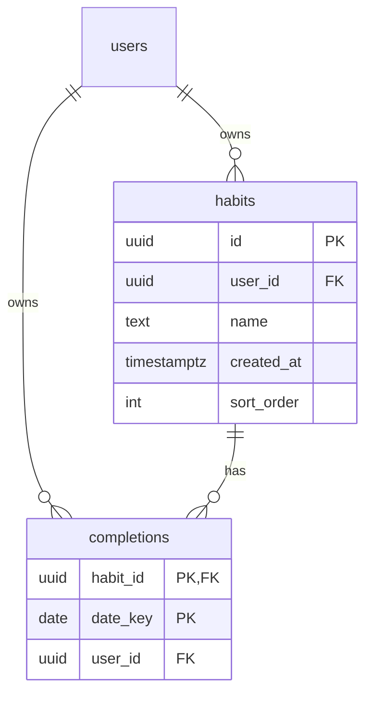

# Supabase スキーマ / マイグレーション

`migrations/` にスキーマと RLS の定義を SQL で置く。**DB の変更はここに追記**し、
手作業で直接いじらない（履歴を残し、別環境へ再現適用できるようにするため）。

## テーブル構成



> `users` は Supabase の認証が管理する **`auth.users`**（`auth` スキーマ）。このマイグレーションでは
> 作成せず `references auth.users(id)` で参照のみ。`habit_id` は主キーの一部かつ `habits` への外部キー（PK,FK）。

- `completions` の主キーは `(habit_id, date_key)`。同じ習慣・同じ日は1行だけ。
- 「今日やった」のトグルは `completions` の **行 insert / delete** に対応。
- すべての行に `user_id` を持たせ、**RLS で「自分の行だけ」をDB側で強制**する。

## 適用手順（どちらか）

### A. Supabase ダッシュボード（最短）
1. プロジェクトの **SQL Editor** を開く。
2. `migrations/20260627000000_init_habits_completions.sql` の中身を貼り付けて実行。

### B. Supabase CLI（推奨・継続運用向け）
```bash
# 初回のみ: CLI 導入とプロジェクト紐付け
npm i -g supabase
supabase link --project-ref <your-project-ref>

# migrations/ の SQL をリモートDBへ適用
supabase db push
```

## 適用後の動作確認（RLS が効いているか）

RLS の確認＝「ログインしないと読めない／他人の行は見えない」こと。

1. **未ログインでは0件**: SQL Editor ではなくアプリ（または匿名キー）から `select * from habits` →
   行が返らない（RLS で弾かれる）こと。
2. **本人の行は読める**: ログイン状態で1件 insert（`user_id` は default で自動充填）→ その行だけ見える。
3. **他人の user_id では挿入不可**: `insert into habits(user_id, name) values ('<別人のuuid>', 'x')` →
   `with check` 違反で失敗すること。

> 確認は Supabase プロジェクトと `.env`（#32 で用意）が前提。プロジェクト未作成なら、
> 作成後にこの手順を実行する。

---

# 認証（Google ログイン）セットアップ（#C / #36）

コード（`src/lib/auth.ts`）は配線済み。実際にログインを通すには以下の外部設定が要る。

## 前提
- `.env` に `EXPO_PUBLIC_SUPABASE_URL` / `EXPO_PUBLIC_SUPABASE_PUBLISHABLE_KEY`（#32）。
- `app.json` の `scheme` が `habittracker`（deep link 用、設定済み）。

## 手順
1. **Google Cloud Console** で OAuth 2.0 クライアント ID を作成し、Client ID / Client Secret を取得。
2. **Supabase ダッシュボード** → Authentication → Providers → **Google を有効化**し、上記 Client ID / Secret を入力。
3. **Supabase** → Authentication → URL Configuration → **Redirect URLs** に戻り先を追加:
   - ネイティブ: `habittracker://` （app scheme）
   - Web（開発）: `http://localhost:8081`（`expo start --web` のポートに合わせる）
   - 戻り先 URL は `Linking.createURL("/")` が環境ごとに生成する。`npx uri-scheme` 等で実値を確認可。

## 動作確認（C-3 の受け入れ）
- **Web**: `npm run web` → 「Google でログイン」→ Google 認証 → アプリに戻り一覧が出る。
- **ネイティブ（Expo Go）**: `npm start` → 端末で開く → 同様にログイン → 戻る。
  - Expo Go でも OAuth web flow は動く（ネイティブ Sign-In は dev build が必要なので後追い）。
- ログイン後にアプリを再起動してもログイン状態が残ること（AsyncStorage セッション保持）。

## 仕組み（コード側）
- Web: `supabase.auth.signInWithOAuth`（フルリダイレクト、戻りは supabase-js が `detectSessionInUrl` で自動処理）。
- ネイティブ: `signInWithOAuth({ skipBrowserRedirect: true })` → `WebBrowser.openAuthSessionAsync` →
  戻り URL の `?code=` を `exchangeCodeForSession`（PKCE）でセッションに引き換え。
